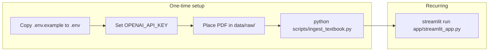

# LearnIQ Execution Sequencing

Execution can be sequenced in two ways: **runtime execution order** (what to run when) and **phase execution order** (roadmap order for building the product).

---

## 1. Runtime execution order (what to run, in sequence)

This is the order to run things so the app works.

### Step-by-step

| Step | Action | When |
|------|--------|------|
| 1 | Copy `.env.example` to `.env` and set `OPENAI_API_KEY` (and optionally `TEXTBOOK_PATH`, `CHROMA_PERSIST_DIR`, etc.) | Once (Phase 0 / setup) |
| 2 | Place the NCERT Grade 8 Science PDF at the path in `TEXTBOOK_PATH` (default: `./data/raw/NCERT_Class8_Science.pdf`) | Once |
| 3 | Install dependencies: `pip install -r requirements.txt` | Once (or when deps change) |
| 4 | Run ingestion: `python scripts/ingest_textbook.py` | Once per textbook/PDF; re-run if you change PDF or chunking |
| 5 | Start the app: `bash scripts/run_app.sh` or `streamlit run app/streamlit_app.py` | Every time you want to use the chat |

**Dependency:** The app expects an existing ChromaDB store at `CHROMA_PERSIST_DIR` (default `./chroma_db`). That store is created only by step 4, so **ingestion must run before the app** the first time (and after any textbook or chunking change).

**One-command sequence (Unix/macOS/Git Bash):** After configuring `.env` and placing the PDF, run `bash scripts/setup_and_run.sh`; it will run ingestion if the ChromaDB store is missing, then start the app.

**Optional:** Before PRs, run the test suite: `pytest tests/ -v` (see [CONTRIBUTING.md](../CONTRIBUTING.md)).

---

## 2. Phase execution order (roadmap / build sequence)

The README defines **Phase 0 → Phase 6** as the sequence for building and rolling out LearnIQ. Execute phases in this order when implementing or planning work.

| Phase | Focus | Key output |
|-------|--------|------------|
| **Phase 0** | Setup and foundation | Repo, `.env`, ingestion pipeline, ChromaDB, benchmark plan |
| **Phase 1** | Textbook-grounded Q&A MVP | PDF ingestion, RAG, citations, Streamlit UI (current MVP) |
| **Phase 2** | Retrieval quality and benchmarking | Benchmarks, retrieval tuning, multi-turn / follow-up handling |
| **Phase 3** | Adaptive quiz layer | Quizzes, scoring, difficulty adaptation, revision |
| **Phase 4** | Teacher dashboard and analytics | Dashboards, weakness heatmaps, class-level insights |
| **Phase 5** | Hindi / bilingual support | Hindi/Hinglish queries and answers |
| **Phase 6** | Market validation and GTM | GTM docs, decks, market framing |

**Current status:** Phase 1 MVP is working locally; current focus is Phase 2 (retrieval quality, benchmarks, follow-up handling).

---

## 3. Ingestion pipeline internal sequence

The script `scripts/ingest_textbook.py` runs three steps in order; you do not need to run them separately:

1. **Load PDF** (`load_pdf`) → 2. **Chunk** (`chunk_documents`) → 3. **Embed and persist** (`build_vector_store`).

---

## Summary

- **To run the app:** Do one-time setup (env, PDF, `ingest_textbook.py`), then start the app with `run_app.sh` or `streamlit run app/streamlit_app.py`. Re-run ingestion only when the textbook or chunking changes.
- **To build the product:** Follow Phase 0 → Phase 6; the project is in Phase 1 done, moving into Phase 2.
